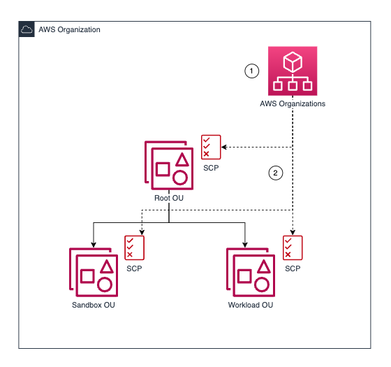

## aws-scps-with-terraform

This pattern:
- uses Terraform to setup a mechanism to easily create and apply [Service Control Policies (SCPs)](https://docs.aws.amazon.com/organizations/latest/userguide/orgs_manage_policies_scps.html) programmatically
- provides example SCPs that can be used or customized

Users can drag + drop `json` templates in the correct directory in `policies`. The module will then do the heavy lifting and apply it to the specified OUs. 

## Prerequisites

- [AWS Organizations](https://docs.aws.amazon.com/organizations/latest/userguide/orgs_introduction.html)
- [AWS CLI](https://docs.aws.amazon.com/cli/latest/userguide/getting-started-install.html)
- [Terraform](https://learn.hashicorp.com/tutorials/terraform/install-cli)

## Limitations

- [SCP Service Limits](https://docs.aws.amazon.com/organizations/latest/userguide/orgs_reference_limits.html) for SCPs. 
- SCPs are a preventative control and can have unintended consequences. Ensure you have a good knowledge of AWS Organizations and Terraform before you deploy this pattern, especially to production environments. 

## Architecture
The pattern will be deployed from a local Repository, using Terraform. 

1. SCPs are created in AWS Organizations
2. These SCPs are then applied to Organizational Units (OUs). 

This pattern defaults to SCPs for Root, Sandbox, and Workload. But this can be fully customized.

These SCPs will be deployed if the pattern is not edited. 

| SCP | OU | description | 
| --- | --- | --- | 
| root_policy | root | prohibit accounts from leaving the organization, creating new IAM users, creating new IAM access keys, and changes to billing details. Deny root user actions and deny external principals.  | 
| sandbox | sandbox | protect sandbox accounts from using services that could be a security risk or incur significant cost | 
| protect_guardduty | workload | deny the deletion of GuardDuty resources. | 

>**These policies are to demonstrate how SCPs can be deployed to different OUs using Terraform. Before deploying to your own accounts you should carefully consider which preventative controls are appropriate for you.** 

## Epics

### (Optional) Add or Edit the OUs 
Add, edit or remove the OUs.
| Story | Description |
|---|---|
| Update modules | Add a new module block or edit an existing module in `main.tf`. Rename the module and change the values for `for_each` file location and `ou_list` variable. 
| Update directories | In the `policies` folder, create a new folder or edit an existing folder with the same name used in the module block. This folder will be used for the SCP `json` files. 
| Edit variables | Create a new variable or edit an existing variable in `variables.tf` to the same name used in the module block. 
| Define variables | Add or edit the OU IDs in `config.auto.tfvars`. Multiple IDs can be included as a list of strings. 

### (Optional) Add or Edit the SCPs
Add, edit or remove the SCP used. These are stored as `json` files in the directories within `policies`. 
| Story | Description |
|---|---|
| Create a new SCP | Create a new `json` file in the correct directory within `policies`. The location depends on the `for_each` file location in `main.tf`. Multiple SCPs can be added per directory. | 
| Edit an existing SCP | Edit the relevant `json` file in the `policies` directories. | 
| Move an existing SCP | Drag and drop the relevant `json` file in correct directory. Eg move it from `scp_examples` to `scp_workload`. | 

### Deploy the pattern
Define the mandatory variables and deploy the pattern. 
| Story | Description |
|---|---|
| Define deployment region | Set region `config.auto.tfvars` |
| Define OUs | Add or edit the OU IDs in `config.auto.tfvars`. Multiple IDs can be included as a list of strings.  |
| Authenticate | Use the AWS CLI and credentials to access the Organization Management account  |
| Deploy SCPs | Initialize the directory and apply |

## Related Resources

- [SCPs (AWS Organizations User Guide)](https://docs.aws.amazon.com/organizations/latest/userguide/orgs_manage_policies_scps.html)
- [Resource: aws_organizations_policy](https://registry.terraform.io/providers/hashicorp/aws/latest/docs/resources/organizations_policy)
- [Resource: aws_organizations_policy_attachment](https://registry.terraform.io/providers/hashicorp/aws/latest/docs/resources/organizations_policy_attachment)
- [Data Source: aws_organizations_organization](https://registry.terraform.io/providers/hashicorp/aws/latest/docs/data-sources/organizations_organization)

## Security

See [CONTRIBUTING](CONTRIBUTING.md#security-issue-notifications) for more information.

## License

This library is licensed under the MIT-0 License. See the LICENSE file.

